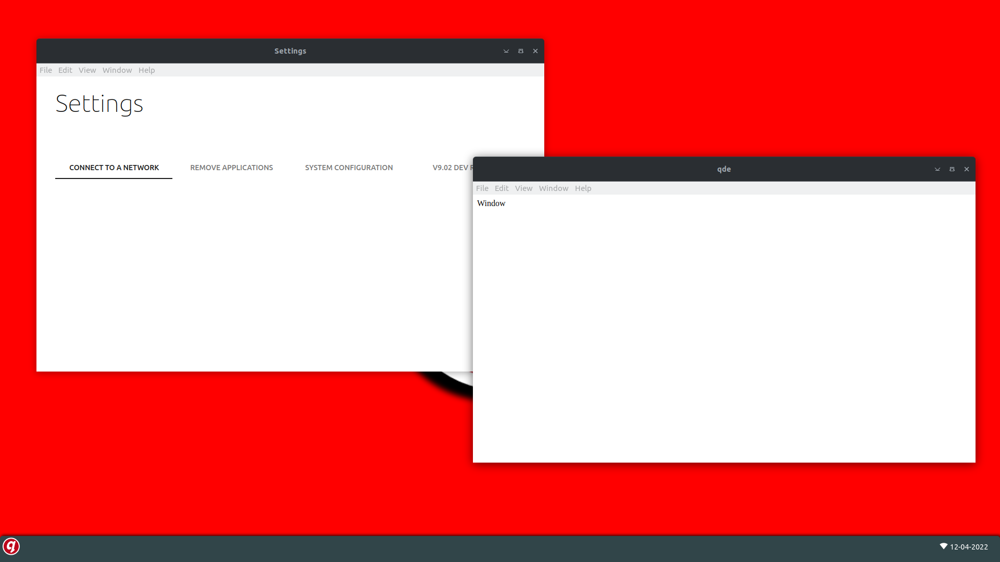

# Questbook Desktop Environment

Questbook(DE) is a Electron based desktop environment that runs on openbox (Display manager). It looks like Windows 8 and ChromeOS, but functions like ChromiumOS (Being Web-based!).

### Screenshots:

 Old layout design (no start menu)

 Old design, no minor changes.

New layout design, with start menu.


# Coming soon
* Wifi support
* DBus support

# How to install?
Check out the release page and try out the latest (or oldest) version of QWM / QDM!
Or clone the git repository!
You need to first install Openbox via your distro's package manager (```apt, rpm, etc.```). 

Then let the script do the rest for you!
After everything has been installed, your computer will reboot and from your Login Manager. Select "Questbook(QDE)" and start testing!